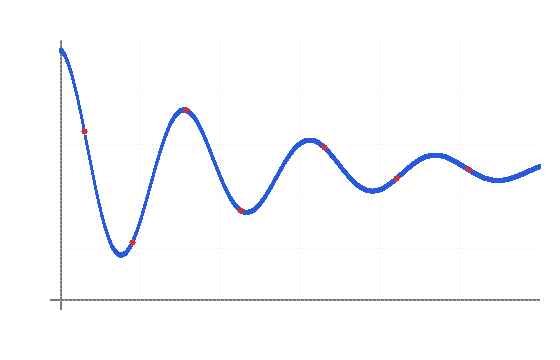

#+TITLE: Welcome to wkbenchless
#+AUTHOR: wkbenchless

* Getting started

This is an example [[https://orgmode.org][Org]] document, opened by default when
you start wkbenchless without a file. Code inside =#+begin_src= blocks is
syntax-highlighted in its own language, right here in the org buffer.

* An R source block

Put the cursor anywhere inside the block below and press =C-c C-c=. wkbenchless
runs the code in a persistent R session, captures its output, and writes a
=#+RESULTS:= block right after it (re-running updates the results in place).

#+begin_src R :session demo
  # Fit a simple model on a built-in dataset
  data(mtcars)
  fit <- lm(mpg ~ wt + hp, data = mtcars)
  coef(fit)
#+end_src

* Sessions: state that persists across blocks

The =:session name= header runs the block in a long-lived process, so variables,
loaded packages, and options carry over to later blocks with the same session
name. =fit= below still exists from the block above:

#+begin_src R :session demo
  round(summary(fit)$r.squared, 3)
#+end_src

The bottom pane is that session, live. Focus it (=C-c n= to cycle panes, or
click it) and type at the =r>= prompt to poke at =fit= directly -- same process.
=C-c s= switches between open sessions; =C-c k= opens a bash terminal.

* Other languages

R, Python, and bash all support persistent =:session= interpreters. Run these
Python blocks in order; the second sees =xs= from the first:

#+begin_src python :session py
  xs = [1, 2, 3, 4]
  print("mean:", sum(xs) / len(xs))
#+end_src

#+begin_src python :session py
  print("max:", max(xs))   # xs persists from the previous block
#+end_src

* Figures inline

Whole-line image links render inline, right in the buffer -- Emacs org-mode
style. Use a bracket link (==) or the Markdown form
(==). By default the image shows at its own dimensions; size it
with a preceding =#+ATTR_ORG: :width N= (aspect ratio is always preserved):

#+CAPTION: A figure rendered inline, sized to 460 px wide.
#+ATTR_ORG: :width 460

Toggle inline rendering any time with =M-x toggle-inline-images=. PNG, JPG and
friends load via a cached conversion (needs ImageMagick); BMP decodes natively.

* LaTeX previews

=M-x latex-preview= renders whole-line display math to images shown in place
(org-latex-preview style), via =latex= + =dvipng=. Put the cursor on a formula
line to edit its source; toggle the command again to turn previews off.

\[
\hat{\beta} = (X^\top X)^{-1} X^\top y, \qquad
\sigma^2 = \frac{1}{n}\sum_{i=1}^{n}(y_i - \hat{y}_i)^2
\]

$$ e^{i\pi} + 1 = 0 $$

* Editing code with LSP

Press =C-c e= inside a block to zoom into it as a real code file: full LSP
completion (=C-Space=), help on the word at the cursor (=F1=), and the
objects/environment pane on the right. =C-c e= again splices it back into the
org document.

* Next steps

- Run any =#+begin_src= block with =C-c C-c=; =C-Enter= sends just the current
  line. Add =:session name= for a shared, persistent interpreter.
- =M-x= (or =C-p=) opens the command palette -- every command is there.
- =C-s= saves. This is a scratch buffer, so pass a path on the command line
  (=wkbenchless file.org=) to save to a real file.
- Your whole configuration is plain Nim in =src/wkbconfig.nim= -- open it with
  =C-c f=, add a =bindkey=, =defcommand=, or =registerRepl=, then =C-c r= to
  recompile and restart in place. The full keymap lives there.
